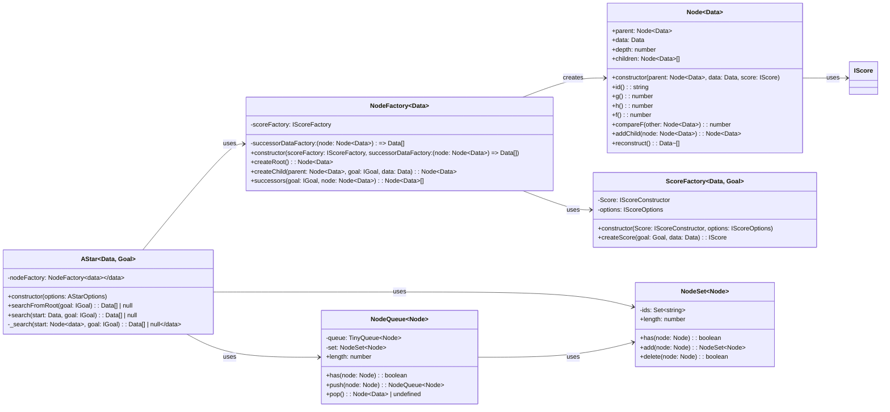

Certainly! I'll provide a comprehensive technical design overview for this A* search algorithm implementation, focusing on the project's philosophy, design patterns, and overall structure. I'll avoid getting into specific code details unless absolutely necessary.

## Project Philosophy and Design

The core philosophy of this A* search algorithm implementation is to provide a flexible, efficient, and type-safe solution that can be easily adapted to various pathfinding and problem-solving scenarios. The project emphasizes encapsulation and modularity, leading to a more intuitive consumer experience.

### Flexibility and Genericity

The implementation is designed to be generic, allowing users to define their own data types and goal conditions. This is achieved through the use of TypeScript generics and interfaces, enabling the algorithm to work with a wide range of problem domains.

### Encapsulation and Modularity

The project is structured into several key components, each responsible for a specific aspect of the A* algorithm. This modular approach enhances maintainability and allows for easier extension or modification of individual parts without affecting the entire system.

### Type Safety

Leveraging TypeScript's strong typing system, the implementation ensures type safety throughout the codebase. This helps prevent runtime errors and provides better developer experience through improved code completion and documentation.

## Design Patterns and Architectural Decisions

### Factory Pattern

The project extensively uses the Factory pattern, particularly in the `NodeFactory` and `ScoreFactory` classes. This pattern allows for the creation of complex objects (nodes and scores) while hiding the implementation details from the consumer.

1. `NodeFactory`: Responsible for creating nodes and generating successors.
2. `ScoreFactory`: Creates score objects used to evaluate nodes.

The factory pattern here provides flexibility in how nodes and scores are created, allowing for easy customization of the search process.

### Decorator Pattern

Decorators are used both for creating a user-friendly interface and developing internal helpers. The `@Score` decorator and various score modifiers (`@Cost.Discount`, `@Cost.Penalty`, etc.) allow for a declarative approach to defining scoring logic.

This pattern enables users to easily customize the scoring behavior without modifying the core algorithm implementation.

### Strategy Pattern

The scoring mechanism implements the Strategy pattern, allowing for different scoring strategies to be easily swapped or combined. This is achieved through the `IScore` interface and the ability to provide custom score implementations.

### Observer Pattern (Implicit)

While not explicitly implemented as a classic Observer pattern, the node structure (with parent-child relationships) and the way the algorithm traverses the search space resembles an observer-like behavior, where child nodes are "notified" of changes in their parent nodes.

## Key Components

1. `AStar`: The main class orchestrating the search algorithm.
2. `Node`: Represents a node in the search tree, containing data and score information.
3. `NodeQueue`: A priority queue for managing open nodes during the search.
4. `NodeSet`: A set data structure for efficient node lookup and management.
5. `ScoreFactory` and `NodeFactory`: Factories for creating scores and nodes, respectively.

## Extensibility and Customization

The project is designed to be highly extensible, allowing users to:

1. Define custom data types and goal conditions.
2. Implement custom scoring logic through the `IScore` interface.
3. Modify scoring behavior using decorators and score modifiers.
4. Customize node creation and successor generation through the factory classes.

## Performance Considerations

1. Memoization: The `@memoize` decorator is used to cache expensive calculations, improving performance for repetitive operations.
2. Efficient Data Structures: The use of `NodeQueue` (based on a priority queue) and `NodeSet` ensures efficient node management during the search process.

## Consumer Experience

The project aims to provide a delightful developer experience by:

1. Offering a clear and intuitive API for setting up and running A* searches.
2. Providing type safety and autocompletion through TypeScript.
3. Allowing for easy customization through decorators and factory classes.
4. Encapsulating complex logic behind simple interfaces.

## Conclusion

This A* implementation strikes a balance between flexibility, performance, and ease of use. By leveraging TypeScript's features and employing well-known design patterns, it provides a robust foundation for solving a wide range of pathfinding and optimization problems. The modular architecture and emphasis on encapsulation make it easy for developers to adapt the algorithm to their specific needs while maintaining a clean and intuitive interface.
